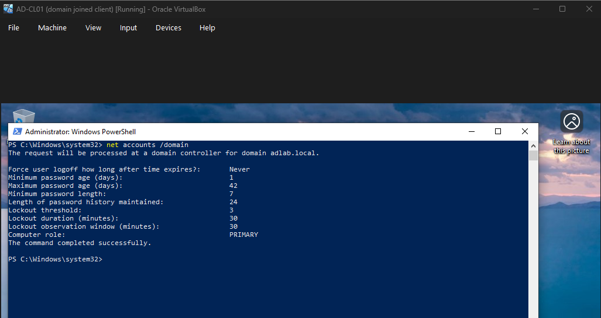
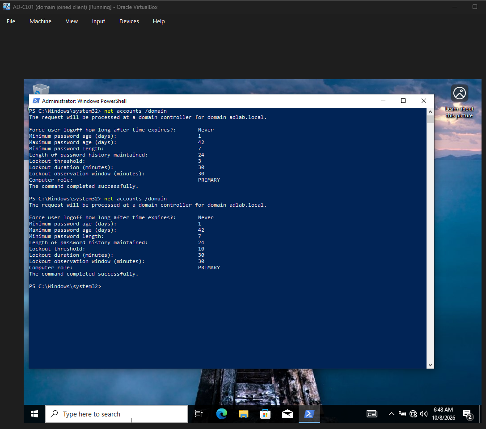

# CR-001 — Raise account lockout threshold from 3 to 10

| Field | Value |
|---|---|
| Requested by | J. Saraza (IT) |
| Implemented by | J. Saraza |
| Approved by | Self (lab). In production: |
| Date / window | 2026-10-08, |
| Change type | |
| Risk | |
| Systems affected | AD-DC01: Default Domain Policy (Account Lockout Policy) |
| Users affected | |

<!-- Approved by: who signs off on a change like this in a real organisation? -->
<!-- Date / window: add the time you'll make the change. -->
<!-- Change type: Standard, Normal or Emergency? Pick one and be ready to defend it. -->
<!-- Risk: Low / Medium / High, plus one reason. What breaks if you get it wrong, and for whom? -->
<!-- Systems affected: confirm this is the GPO where you set lockout in Project 1. -->
<!-- Users affected: who does a domain-level account policy apply to? -->

## Reason for change
User could possibly forget their password, causing them to reach out to unnecessarily reach out to IT, essentially wasting their time as opposed to saving time by allowing for up to 10 attempts on login.
<!-- 2–3 sentences. What's wrong with 3? Your Project 1 README already argues it. What does 10 fix, and what does it give up? -->

## Current state (before), with evidence
Before the change, client workstations had a maximum of 3 attempts on login before being locked out. By running `net accounts /domain` on the admin powershell, it will return the lockout threshold. 

`net accounts /domain` on AD-CL01, 2026-10-08:

    Lockout threshold:                          3
    Lockout duration (minutes):                 30
    Lockout observation window (minutes):       30

#Before

#After

<!-- Fill in after running `net accounts /domain` on AD-CL01: paste the lockout lines and link the screenshot. -->

## Implementation steps
1. Take a VirtualBox snapshot of AD-DC01 named `pre-CR-001`.
2. Group Policy Management → Default Domain Policy → Edit → Computer Configuration → Policies → Windows Settings → Security Settings → Account Policies → Account Lockout Policy.
3. Set Account lockout threshold to 10. Leave lockout duration and reset counter unchanged.
4. Run `gpupdate /force` on AD-DC01.
5. Run `net accounts /domain` on AD-CL01 and confirm the threshold reads 10.

## Backout plan
Rollback trigger:
<!-- What specific result makes you undo this? A command output, or a symptom a user would report. -->

1.
<!-- Two ways back: the fast one (snapshot) and the precise one (reverse the setting). Which do you use first, and why? -->

## Verification, from the user's side
**Test:** sign in to AD-CL01 as `tnguyen` with the wrong password 4 times, then with the correct password.
**Expected:** sign-in succeeds, and `Search-ADAccount -LockedOut` on AD-DC01 returns nothing.

**Result:**

## Outcome
<!-- Completed / Rolled back / Partial: what happened, and anything unexpected. -->
